<p align="center"></p>

<p align="center">
  <b>Flutter</b> · <b>Gemini</b> · <b>RevenueCat</b> · on-device speech · local-first · MIT
</p>

---

## 👋 Meet the cloud


The cloud is the other person — your manager, your report, your angry client.
It rests looking up and away, blinks, and turns to face you the moment you
start talking. Everything else in VERBAL is black, grey and white, so the
cloud is the only thing on screen with a face. You always know where to look.

<br clear="right">

## 😬 The problem

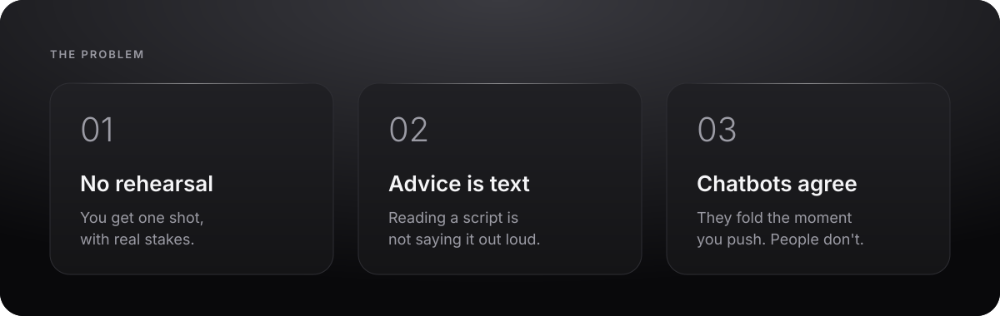

The conversations that shape a career — the raise, the hard feedback, the
"we're letting you go" — happen **once**, live, with no rehearsal.

## 💊 The painkiller

**Practise it out loud, against someone who pushes back, then see exactly what
worked.**

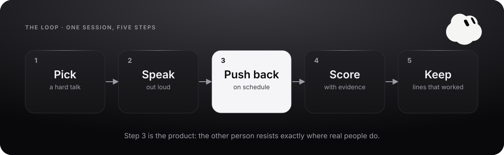

| | |
|---|---|
| 🎙️ **Voice, not chat** | You hold and speak. It answers in a real voice. |
| 🧱 **Pushes back on schedule** | A deterministic engine decides *when* objections land. |
| 🎯 **Catches the mistake** | Bury the headline or apologise for the decision, and it reacts. |
| 📊 **Scores with evidence** | Six skills plus DEAR MAN, each tied to your own words. |
| 📒 **Keeps what worked** | Your best lines go into a Playbook for next time. |

## ✨ What makes it different

| Everyone else | VERBAL |
|---|---|
| A chatbot that folds when you push | An engine that **holds its position** until you earn the concession |
| The model decides everything | **The model observes, the engine decides** — measured, not hoped |
| "Be more confident" | "Turn 3: you defended before acknowledging. Try: *…*" |
| Your transcripts on a server | **Everything stays on the phone** |
| Claims | A **benchmark in the repo** you can rerun |

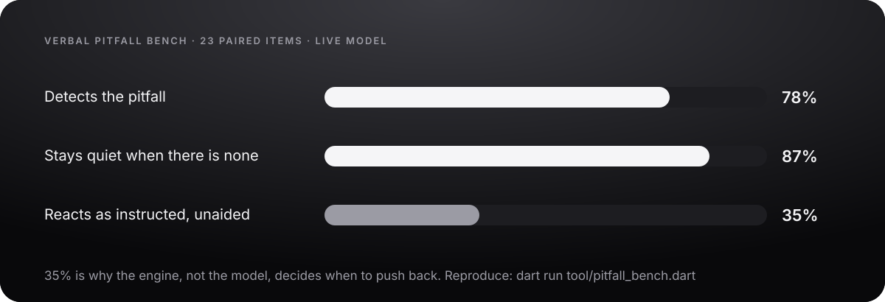

The model is good at *noticing* a mistake and bad at *acting* on it unaided.
So VERBAL lets it notice and makes the engine act. That split is the product.

## 🔁 One turn, end to end

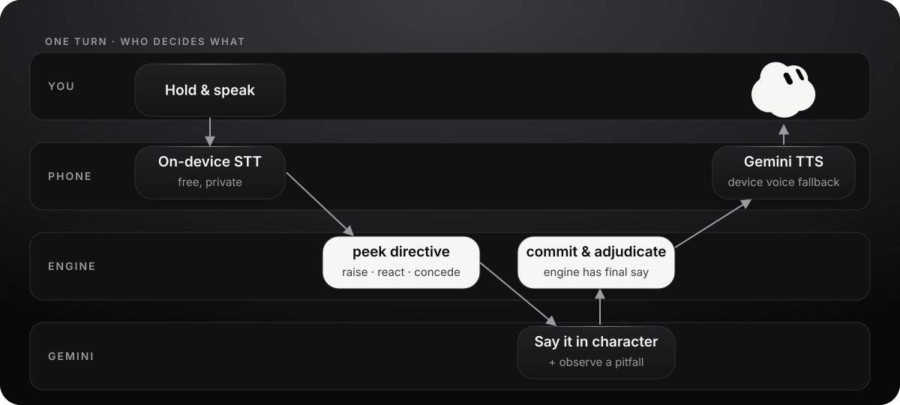

## 🏗️ Architecture

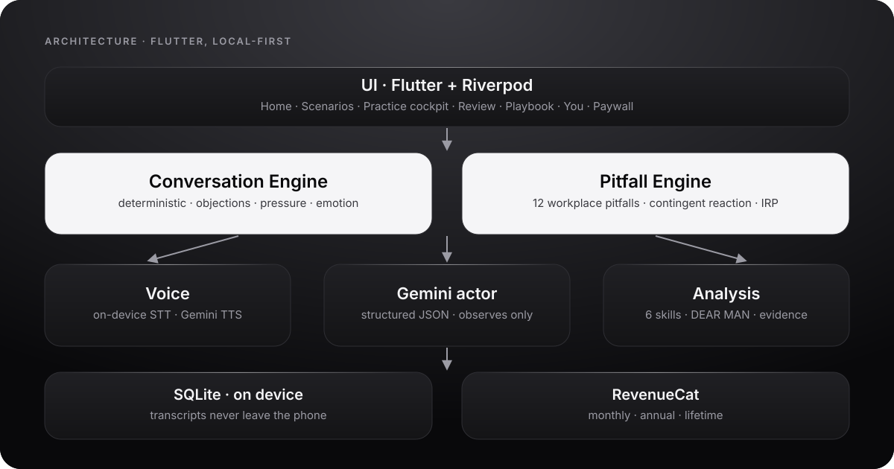

## 📱 The app

<p align="center">
  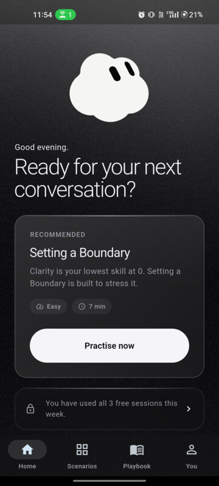
  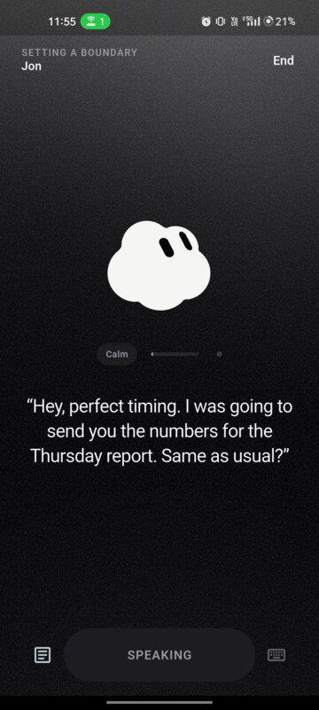
  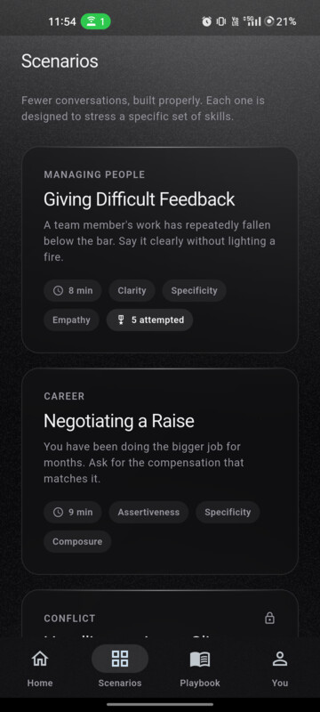
  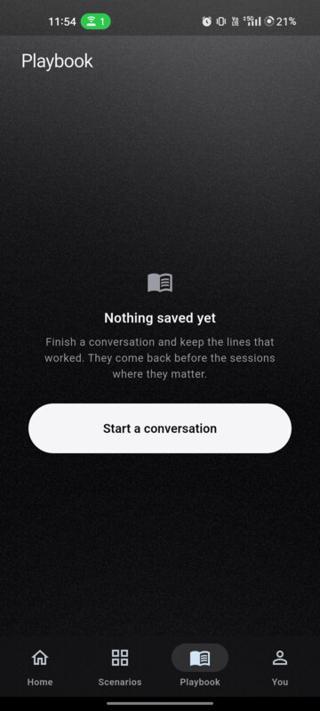
</p>
<p align="center">
  <sub><b>Home</b> — one thing to do next &nbsp;·&nbsp; <b>Practice</b> — the cloud, the line, one button &nbsp;·&nbsp; <b>Scenarios</b> — five hard talks &nbsp;·&nbsp; <b>Playbook</b> — lines that worked</sub>
</p>
<p align="center">
  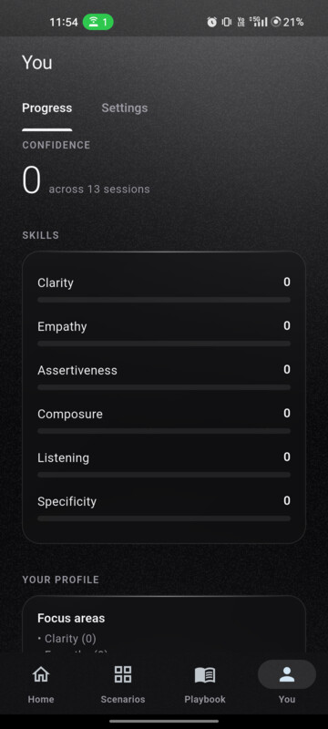
  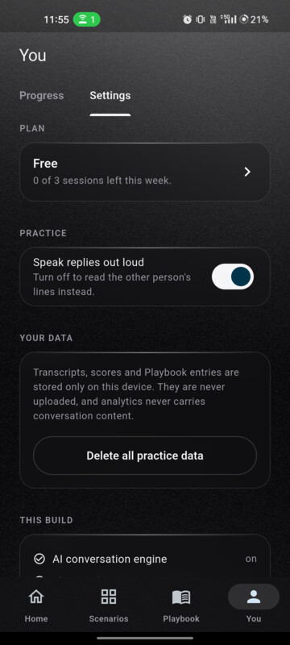
  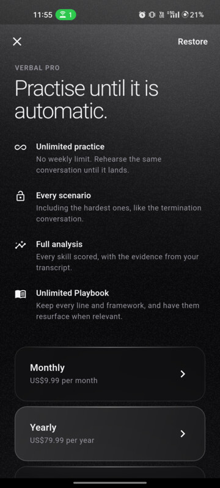
</p>
<p align="center">
  <sub><b>Progress</b> — six skills over time &nbsp;·&nbsp; <b>Settings</b> — your data stays here &nbsp;·&nbsp; <b>Pro</b> — live RevenueCat offerings</sub>
</p>

## 🎭 Five conversations

| | Scenario | Who | Stresses |
|---|---|---|---|
| 🗣️ | Giving Difficult Feedback | Maya | clarity · empathy · specificity |
| 💰 | Negotiating a Raise | Ray | assertiveness · composure |
| 🛑 | Setting a Boundary | Jon | assertiveness · clarity |
| 😠 | Handling an Angry Client · **Pro** | Delia | composure · listening |
| 📄 | Termination Conversation · **Pro** | Tom | clarity · empathy |

## 💳 Monetisation

Free: 3 sessions a week. **Pro** (monthly · annual · lifetime) unlocks unlimited
practice, the two hardest scenarios, full analysis and an unlimited Playbook —
powered by **RevenueCat**, offerings fetched live.

## 🚀 Run it

```bash
cp .env.example .env.local        # add GEMINI_API_KEY (+ RevenueCat test key)
flutter pub get
flutter run --dart-define-from-file=env.json
flutter test                      # 221 tests
dart run tool/pitfall_bench.dart  # reproduce the bench
```

No key? It still runs: scripted lines, device voice, honest fallbacks.

---

# 🔬 Deep dive

Everything below is the full engineering write-up: the engine, the research,
the bench, the voice loop, and an honest list of what is and isn't built.

## The scenario engine

**The problem with LLM roleplay is that it is agreeable.** Ask a model to play a
defensive employee and it will fold the moment you sound reasonable — or escalate
forever if you prompt it to be difficult. Neither is a rehearsal.

VERBAL puts a **deterministic state machine** around the model. The engine owns
what happens; the model only owns the words.

[`lib/domain/conversation_engine.dart`](lib/domain/conversation_engine.dart)

The engine decides, each turn:

- which objection is raised, and when
- the actor's emotional state and escalation stage
- how much pressure is in the room
- **whether the actor is permitted to concede at all**
- when the conversation closes

The model receives that as a turn directive, returns a line, and reports
structured evidence about the user's turn — which objection they engaged,
whether they acknowledged the emotion, whether they held their position, whether
they gave a concrete example, plus one plain observation of what they did. The
engine advances on that evidence.

That shape is **enforced by a Gemini `responseSchema`**, not requested politely
in the prompt — models drift into prose exactly when a conversation gets
emotional, which is when the evidence matters most. The live turn also runs with
`thinkingBudget: 0`: reasoning tokens are seconds of dead air in a spoken
conversation, and the engine already does the thinking that matters.

The result: the actor cannot be talked out of the scenario, and cannot escalate
into incoherence.

### Difficulty is behavioural, not a label

Each level is a profile of real parameters, not a prompt adjective:

| | Easy | Moderate | Hard | Expert | Boss |
|---|---|---|---|---|---|
| Objections used | 1 | 2 | 3 | 4 | 5 |
| New objection every | 3 turns | 2 turns | 2 turns | 1 turn | 1 turn |
| Well-handled before conceding | 1 | 2 | 2 | 3 | 4 |
| Escalation per bad turn | none | 1 stage | 1 stage | 2 stages | 2 stages |
| Can end early | yes | yes | no | no | no |
| Turn ceiling | 10 | 12 | 14 | 16 | 18 |

On Easy the actor never escalates. On Boss they escalate twice per unanswered
objection, run competing objections, and will not concede until you have handled
four of them. Same scenario, materially different conversation.

### Objections are fought on a layer

Every objection is tagged `interest`, `rights` or `power` — Interests-Rights-Power,
from Rehearsal. Ray hides behind budget and process (rights) until he tests
whether you are threatening to leave (power). Tom asks for one more chance
(interest) before arguing the process was unfair (rights).

The actor is told which layer to stand on and how to argue from it, which turns
escalation from a generic intensity ramp into movement along a named axis — and
gives the learner something specific to do about it: bring the conversation back
down to interests.

### An objection is not "handled" by repeating yourself

```dart
final handledWell = addressed &&
    (signal.acknowledgedEmotion || signal.gaveSpecificExample);
```

Restating your position does not clear an objection. Acknowledging how the other
person feels, or producing something concrete, does. That single rule is what
makes the scenarios teach anything.

### Scenario library

Five, authored properly, rather than twenty shallow ones.

**Giving Difficult Feedback** — Maya, a senior analyst whose work has slipped.
Articulate, deflects with reasonable explanations, then gets hurt.
*"You never told me this was serious."*

**Negotiating a Raise** — Ray, your director. Blunt, numerate, defaults to no.
*"The budget for this cycle is already allocated."*

**Termination Conversation** — Tom, three years on the team. Shock, then
bargaining, then grief. *"Can I have one more chance?"*

**Handling an Angry Client** — Delia, furious, partly right. Some of the delay
was yours, some was hers. *"Do not you dare put this on my team."*

**Setting a Boundary** — Jon, likeable, keeps handing you six hours a week of
his work. The pressure is social, not hostile. *"Okay, but just this week?"*

Each carries a full brief: situation, actor personality and objective, the facts
the actor is allowed to assert, hard behavioural constraints, five weighted
objections with resolution criteria, escalation stages, and success criteria.

### Safety

The actor is constrained at two levels — globally in
[`actor_prompt.dart`](lib/domain/actor_prompt.dart), and per-scenario.

The global limits: never claim to be a real person; **never state or imply what
is legally required, valid or permitted anywhere**; never give HR, legal, medical
or financial advice; only assert facts from the scenario's `knownFacts`; drop
character entirely if the user says something genuinely distressing.

The termination scenario adds explicit bans on employment law, statutes and
tribunal outcomes. The pressure there is emotional, which is the part worth
rehearsing. These constraints are covered by tests.

---

## Research grounding

Most "AI roleplay for difficult conversations" apps are a system prompt and a
chat box. VERBAL's mechanism comes from four peer-reviewed systems. Every claim
below was checked against the papers' own text, including the one we chose
**not** to follow.

| Paper | What VERBAL takes |
|---|---|
| **Rehearsal** — Shaikh, Chai, Gelfand, Yang, Bernstein (Stanford), [arXiv:2309.12309](https://arxiv.org/abs/2309.12309) | Interests-Rights-Power. Every objection is tagged with the layer it is fought on, and the actor argues from that layer. |
| **IMBUE** — Lin, Sharma, Rytting et al., [arXiv:2402.12556](https://arxiv.org/abs/2402.12556) | DEAR MAN, the DBT interpersonal-effectiveness rubric, scored alongside the six skills. |
| **SIC-Agents** — Wang, Slominska, Bimman et al., [arXiv:2608.29481](https://arxiv.org/abs/2608.29481) | The trigger turn: contingent adaptation the moment a learner commits a pitfall, plus a paired benchmark to measure it. |
| **EvoEmo** — Long, Xu, Beckenbauer, Liu, Brintrup (Cambridge / Alan Turing), [arXiv:2509.04310](https://arxiv.org/abs/2509.04310) | **Deliberately not adopted.** See below. |

Their published results are theirs, not VERBAL's: Rehearsal measured a 67%
reduction in escalating competitive strategies across 40 participants; IMBUE's
feedback was rated 25% more expert-like than GPT-4's. **VERBAL has not run a
human study.** The only numbers VERBAL reports as its own come from the bench
below.

### The trigger turn

Scoring a conversation afterwards is easy and teaches slowly. What teaches is a
consequence that arrives *in the conversation*, at the exact moment the mistake
is made.

[`lib/domain/pitfall.dart`](lib/domain/pitfall.dart) defines twelve workplace
pitfalls. Each carries a detection hint, the skilled alternative, and — the part
that matters — a **required reaction**:

```dart
Pitfall(
  id: 'bury_the_headline',
  detectionHint: 'The turn was mostly preamble, and the actual message was '
      'buried at the end or never arrived.',
  skilledAlternative: 'Say the hard thing in the first two sentences.',
  requiredReaction: 'Take the softening entirely at face value. Respond as '
      'though the news is good, and be visibly reassured.',
)
```

Soften too much and the other person cheerfully misunderstands you, and you have
to say it again — properly. That is the lesson, delivered by the conversation
rather than by a score.

The taxonomy is **re-derived for the workplace**. SIC-Agents' own pitfalls are
pediatric palliative-care moves and do not transfer; what transfers is the
method — a trigger turn, a paired skilled alternative, and an acceptance rule
that can be audited.

### The model observes, the engine decides

The actor model reports a `pitfallId` in the same structured response it already
returns, so detection costs no extra latency on a spoken critical path. It has
no authority: the engine rejects any pitfall that is not valid for the running
scenario, decides whether it fires, and schedules the contingent reaction for
exactly one following turn.

```text
user turn → model reports pitfallId → engine validates → directive carries
requiredReaction → actor must perform it next turn → engine clears it
```

This keeps the architecture VERBAL already had, and is SIC-Agents' "explicit,
auditable acceptance rule" — the rule lives in source, not in a judge's opinion.

### Why EvoEmo is cited but not used

EvoEmo evolves emotional policies for an adversarial negotiator to extract
better outcomes from its counterpart. Applied here it would mean tuning the
actor to defeat the learner, and a trainer optimised to beat you teaches
nothing. Deliberate practice needs contingency and immediate feedback, which is
what SIC-Agents and Ericsson describe.

Worth stating precisely, because it is widely misquoted: EvoEmo found sustained
negative emotion wins better *prices* but **raises the risk of breakdown**, and
that success rates favour positive strategies. Its contribution is dynamic
adaptation resolving that tension — not "negativity wins".

VERBAL keeps deterministic escalation instead of a stochastic transition matrix,
because reproducibility is what makes practice deliberate. The same conversation
should put the same pressure on you twice.

---

## VERBAL Pitfall Bench

Anyone can cite a paper. This is the part you can run.

```bash
flutter test test/pitfall_engine_test.dart        # tier 1 — no API key
dart run tool/pitfall_bench.dart --key=$GEMINI_API_KEY   # tier 2
```

**Tier 1 — the mechanism (35 tests, no key, runs in CI).** A recorded pitfall
produces a contingent reaction, exactly once; an invented or out-of-scenario
pitfall id is refused; a pitfall escalates even when the objection was answered
well. This half is deterministic and therefore guaranteed.

**Tier 2 — the model (24 paired items, real Gemini).** Following PitfallBench's
paired design: identical history, two candidate turns for the same moment — one
committing the pitfall, one taking the skilled alternative. Three measures:

| | what it asks |
|---|---|
| `detect` | was the pitfall turn correctly identified? |
| `clean` | was the skilled turn correctly left alone? |
| `react` | did the actor then actually carry out the required reaction? |

Compliance is judged against the pitfall's own `requiredReaction` string — the
same text the actor was instructed with — so the score is auditable rather than
a second model's taste. Results are written to `bench/results/`.

24 items is small, and deliberately so: PitfallBench's 1,000 are a research
artifact built with clinicians.

### Measured results

Run on 2026-09-30, 24 paired items, 23 scored (one lost to a rate limit).
Raw output in [`bench/results/`](bench/results/).

| pitfall | n | detect | clean | react |
|---|---|---|---|---|
| absolutes | 1 | 100% | 100% | 100% |
| apologise_for_the_decision | 1 | 100% | 100% | 100% |
| vague_without_example | 2 | 50% | 100% | 100% |
| blame_shift | 2 | 100% | 100% | 50% |
| false_hope | 2 | 100% | 100% | 50% |
| fake_question | 2 | 100% | 50% | 50% |
| match_the_heat | 2 | 0% | 100% | 50% |
| bury_the_headline | 2 | 100% | 50% | 0% |
| defend_before_acknowledge | 3 | 67% | 67% | 0% |
| negotiate_against_self | 2 | 100% | 100% | 0% |
| over_explain | 2 | 50% | 100% | 0% |
| solution_before_validation | 2 | 100% | 100% | 0% |
| **overall** | **23** | **78%** | **87%** | **35%** |

**Caveat that matters:** this ran on `gemini-3.1-flash-lite`, not the app's
default `gemini-3.5-flash`. The free tier caps 3.5-flash at 20 requests per day
and the bench needs roughly a hundred. A lite model is the weakest case, not the
representative one, and the numbers should be read that way.

### What the numbers say

**Detection mostly works (78%), and false positives are low (87% clean).** The
model can see these mistakes when told what to look for. `match_the_heat` scored
0/2 — it does not reliably notice when the *user* escalates tone, which is a
detection-hint problem, not a model ceiling.

**Compliance is poor (35%).** Told explicitly that the user buried the headline
and that it must respond as though the news were good, the model usually
reverted to a sensible, contextually coherent reply instead. It prefers
plausibility over instruction.

That is the most useful thing the bench has produced, because **it is the
argument for the architecture**. If scenario state lived in the model — as it
does in a prompt-and-chat-box app — 35% instruction compliance would mean
incoherent sessions: objections forgotten, difficulty ignored, conversations
that resolve because the model felt like resolving them. Because the engine owns
escalation, objection scheduling and concession, a non-compliant reaction costs
one teaching moment and nothing else. The conversation stays intact.

A number this low would normally be buried. It is here because the honest
version is more convincing than the flattering one: **we can measure the part
that is unreliable, and we have contained it.**


---

## The voice experience

Speech recognition runs **on-device** ([`speech_to_text`]) rather than through a
cloud STT API. Three reasons: no per-turn latency cost, no per-turn billing, and
your speech does not leave the phone — only the finished text is sent to the
actor model.

The actor speaks through **ElevenLabs**, falling back to the device voice if the
key is absent, the request times out, or the API returns anything unexpected. A
voice outage degrades the session; it never ends it.

The practice screen is a **simulation cockpit, not a chat UI**: one large line
from the other person, a system state that is always legible
(`LISTENING · THINKING · SPEAKING · PAUSED · ERROR`), a live waveform, a pressure
meter in the app bar, and one control. The transcript is one tap away but
deliberately secondary — you should be listening, not reading.

Typed input is always available, as the fallback when recognition is unavailable
and as the accessibility path.

### One turn at a time

A voice turn has three ways to start — a final transcript arriving, the talk
button being released, typed input — and on a real device two of them can fire
within milliseconds of each other. A session is therefore a single authoritative
[`VoicePhase`](lib/domain/session.dart) (`idle · listening · processing ·
speaking · paused · completed · error`), with `isFinished` *derived* from it
rather than stored alongside it, so the two can never disagree.

The pipeline holds one lock and one sequence number:

```text
START TURN → LISTEN → FINAL TRANSCRIPT → SUBMIT
          → ACTOR THINKING → ACTOR RESPONSE → TTS → READY
```

A second submit while a turn is in flight is refused, not queued. A reply that
arrives after its turn has been superseded is dropped. The microphone cannot
open while the actor is speaking. All of this is tested — see
`turn discipline` in `test/practice_loop_test.dart`.

### A failed turn does not cost you an objection

The engine separates `peekDirective()` from `commitDirective()`. The directive is
only committed once the actor's line actually exists, so an AI timeout does not
silently consume the objection the actor was about to raise. The user's words are
kept and **Send that again** replays the turn — re-raising the same objection
rather than skipping to the next one.

### Latency is measured, not estimated

Each turn records real stage timings — transcript, actor, speech — and exposes
`toFirstAudioMs`, which is the number the user actually feels. They are attached
to the `voice_turn_completed` event. **No latency figures are published here**,
because they have not been measured on physical hardware; the instrumentation
exists so that they can be.

---

## Post-session intelligence

Six skills, scored 0–100 with evidence: **clarity, empathy, assertiveness,
composure, listening, specificity**. The scenario's focus skills are weighted
highest.

The analysis prompt explicitly bans generic coaching — *"be more confident"*,
*"great job"* and anything that would apply equally to any conversation are
prohibited, and every observation must quote the transcript.

Observations are captured **turn by turn while the conversation is live** and
handed to the analyser alongside the transcript, so scores rest on what the other
person actually noticed at the time rather than on a bare re-reading afterwards.
Each score's note must name the behaviour behind it — *"You answered the
objection directly but did not acknowledge her reaction before defending the
decision"*, not *"your empathy was moderate"*.

You get: a two-line summary, whether the objective was met, per-skill scores with
notes, the pitfalls that actually fired with their skilled alternatives, what
worked, what weakened the conversation, **a specific rewritten line** you could
have used instead, and the single highest-impact skill to practise next.

Alongside the six skills sits **DEAR MAN** — Describe, Express, Assert,
Reinforce, Mindful, Appear confident, Negotiate — the DBT rubric IMBUE
validated. The six describe how the conversation *felt*; DEAR MAN describes
whether the ask was actually *built* properly. It is additive: a session saved
before it existed simply has none.

**When analysis fails, it fails honestly.** No invented scores, no filler
feedback — the transcript is saved and the summary says analysis was unavailable.
The parser handles the ways models actually misbehave (markdown fences,
surrounding prose, missing fields, out-of-range scores, unknown skill names), and
that is unit tested.

---

## The Playbook

The reason practice compounds instead of evaporating.

Every session proposes reusable assets — winning lines, better alternatives,
frameworks, principles, mistakes to avoid — and you keep the ones worth keeping.

```text
HANDLING DEFENSIVENESS

Your saved line:
"I want to acknowledge what you're saying before I explain the decision."

Why it works:
Acknowledges emotion without abandoning the objective.

Used in 3 sessions
```

The Playbook is searchable across the line, its title and its reasoning — a
saved line is usually remembered by a phrase inside it, not by the name it was
given — and filterable by skill.

**Saving is half the feature. Reuse is the other half.** Before a session,
[`PlaybookMatcher`](lib/domain/playbook.dart) surfaces the entries most relevant
to that scenario — weighted by whether they came from this scenario, whether they
serve a skill it stresses, and how recently they were created, with frequently
surfaced entries demoted so the same line does not appear forever. Surfacing is
what increments "used in N sessions", so that number is real.

```text
Practice → Learn → Save → Reuse → Improve → Practice again
```

---

## Personalisation

A communication profile derived **entirely from session results** — nothing
self-reported, nothing invented.

Rolling averages over the last five analysed sessions, with a delta against the
previous five. Scenario mastery tracks the hardest difficulty you have actually
cleared (70+), not the hardest you have attempted.

The observed pattern stays silent until there are at least three sessions and a
15-point spread between your strongest and weakest skill. Below that there is no
signal, so it says nothing rather than guessing.

> *"You make your point well, but you tend to move on before acknowledging how
> the other person feels."*

---

## Retention

Value, not streaks.

```text
Session ends → weakness identified → next scenario recommended
            → a Playbook entry created → a reason to return
```

[`Recommender`](lib/domain/recommendation.dart) picks the next practice from your
weakest skill, prefers the scenario that stresses it and that you have practised
least, and **steps difficulty up only after you have actually cleared the current
one**. Fail a level and it holds; fail badly and it drops you back down.

Notification copy is modelled in
[`core/notifications.dart`](lib/core/notifications.dart), tied to real changes in
practice state rather than a generic "come back". **No push provider is wired
into this build** — the interface is the seam where one goes.

---

## Monetisation

| | Free | Pro |
|---|---|---|
| Practice | 3 sessions a week | Unlimited |
| Scenarios | Free scenarios | Every scenario, including Termination |
| Analysis | Full | Full |
| Playbook | Full | Full |

The free tier is deliberately not crippled — the product has to be worth paying
for, which means the free version has to work.

The weekly counter is a **product convenience, not a security boundary**, and is
documented as such in code. Real entitlement always comes from the store.

---

## RevenueCat

All purchasing lives behind one abstraction —
[`BillingService`](lib/core/billing.dart). The UI asks `hasProAccess` and never
imports the RevenueCat SDK.

```text
BillingService
├── entitlements   (Stream<Entitlement>)
├── current
├── offerings()
├── purchase(planId)
├── restore()
└── identify(userId)
```

Two implementations: `RevenueCatBilling` and `UnconfiguredBilling`. The
unconfigured path is a first-class implementation, not an error state — with no
key the app runs free-tier and the paywall says plainly that purchasing is
unavailable in this build, rather than showing fabricated prices.

Failures are mapped to typed `BillingFailure`s. A store outage never crashes the
app, and a cancelled purchase is not reported as an error.

---

## Analytics

Every event is a typed enum ([`core/analytics.dart`](lib/core/analytics.dart)),
serialised to snake_case. No string literals at call sites.

`app_opened` · `onboarding_started` · `onboarding_completed` ·
`scenario_viewed` · `scenario_selected` · `practice_started` · `voice_turn` ·
`practice_completed` · `session_completed` · `analysis_viewed` ·
`playbook_created` · `playbook_reused` · `next_practice_selected` ·
`paywall_viewed` · `purchase_started` · `purchase_completed` ·
`purchase_failed` · `notification_opened` · `experiment_exposed`

**Analytics never carries conversation content.** A debug assertion rejects
`transcript`, `reply`, `text` and `quote` properties outright, and it is tested.

The default sink writes to the debug console. **No third-party analytics provider
is connected in this build** — swapping `AnalyticsSink` is the only change needed.

---

## Experimentation

[`ExperimentService`](lib/core/experiments.dart) assigns variants by a stable
FNV-1a hash of the user id, so assignment survives relaunch without a server.

The first experiment: **does showing the Playbook immediately after the first
session increase repeat practice?** Control ends at the score screen; the variant
routes through the Playbook to the next recommended practice.

Exposure is tracked where the surface actually renders, not at assignment.

**No results are reported here, because no real cohort has run.** Fabricated
experiment numbers would be worse than none.

---

## Architecture

Flutter, Riverpod, go_router. One state-management paradigm throughout.

```text
lib/
├── app/          theme · router · shell · providers · bootstrap
├── core/         config · failures · logging · analytics · billing
│                 experiments · notifications · voice
├── domain/       pure Dart. no I/O, no Flutter widgets — all unit tested
│   ├── scenario · difficulty · scenario_library
│   ├── conversation_engine   ← the deterministic core
│   ├── actor_prompt · analysis · analysis_prompt
│   └── playbook · progress · recommendation
├── data/
│   ├── local/    sqflite + shared_preferences, plus in-memory doubles
│   └── remote/   Gemini actor service + scripted offline actor
├── features/     onboarding · home · scenarios · practice · analysis
│                 playbook · progress · profile · paywall
└── shared/       widget library
```

The rule that keeps it testable: **`lib/domain/` imports nothing from Flutter and
performs no I/O.** Every piece of product logic worth trusting — escalation,
scoring, playbook relevance, progress maths, recommendation — lives there and is
tested without a device.

`ScenarioRepository` is deliberately absent. Scenarios are authored constants; a
repository around a `const` list would be an interface with one implementation
and no second caller.

### Degradation

Each external dependency has a defined fallback, because a rehearsal tool that
only works on a good day is not a tool:

| Missing | Behaviour |
|---|---|
| ElevenLabs rejects the voice (402/401) | Falls through to Gemini TTS. This is the live behaviour today. |
| Gemini TTS unavailable too | Device voice. Still speaks, just flatter. |
| Gemini key / API down | Scripted rehearsal using the scenario's authored objections. Engine, pacing and escalation are unchanged. |
| ElevenLabs key / timeout | Device text-to-speech |
| Speech recognition | Typed input, with the reason shown |
| Microphone denied | Exact instructions to re-enable, and typing still works |
| Actor call fails mid-turn | Words kept, objection not consumed, one-tap retry |
| TTS never reports completion | Bounded by a per-line budget; session continues |
| Mic permanently denied | Settings shortcut offered; typing still works |
| Analysis fails | Transcript saved, no invented scores |
| SQLite unopenable | In-memory for the session, app still launches |
| RevenueCat absent | Free tier, paywall states purchasing is unavailable |

---

## Local setup

```bash
flutter pub get
flutter test
flutter run
```

It runs with **no configuration at all** — that path gives you the scripted
actor and the device voice, which is enough to see the whole loop.

For the real experience, copy `env.example.json` to `env.json` (gitignored) and
fill in what you have:

```bash
flutter run --dart-define-from-file=env.json
```

| Variable | Without it |
|---|---|
| `GEMINI_API_KEY` | Scripted actor instead of a generative one |
| `ELEVENLABS_API_KEY` | Device voice |
| `ELEVENLABS_VOICE_ID` | Defaults to a standard voice |
| `REVENUECAT_ANDROID_KEY` / `REVENUECAT_IOS_KEY` | Free tier only |
| `ONESIGNAL_APP_ID` | Unused — no push provider is wired up |

Settings › This build shows exactly which of these are live at runtime.

---

## Testing

```bash
flutter analyze
flutter test
```

221 tests. They cover the parts where being wrong is expensive:

| Area | What is asserted |
|---|---|
| `pitfall_engine_test` | Tier 1 of the bench: contingent reaction scheduled and delivered once, invented and out-of-scenario ids refused, a pitfall escalating even on a well-handled objection, IRP layering, taxonomy and bench-fixture integrity |
| `conversation_engine_test` | Objection scheduling, escalation, the "restating yourself doesn't count" rule, concession gating per difficulty, closing, pressure bounds, lifecycle, peek/commit |
| `practice_loop_test` | The full loop with fake services: opening, turn exchange, engine advance, save, AI outage, denied microphone, **double-submit rejection, stale-turn dropping, retry, latency recording** |
| `voice_test` | Speech budget bounds, permanent vs ordinary mic denial, every failure message being short and actionable; both TTS request shapes; the guards that refuse to hand a JSON error body to the audio player; and the provider chain falling through ElevenLabs → Gemini → device |
| `analysis_test` | Parsing real model misbehaviour — fences, prose, braces in strings, out-of-range scores, unknown skills, unparseable junk; DEAR MAN including the `assert` keyword clash; engine-recorded pitfalls surviving an analysis failure |
| `playbook_test` | Relevance ranking, demotion of overused entries, persistence round-trip |
| `progress_test` | Rolling windows, deltas, mastery, silence when evidence is thin |
| `recommendation_test` | Weak-skill targeting, difficulty stepping up only after clearing |
| `billing_test` | Entitlement states, allowance maths, typed failures, the `hasPro` gate following the entitlement stream in both directions, Test Store key handling |
| `analytics_test` | Event naming, the no-transcript rule and the release-safe filter, experiment assignment stability |
| `scenario_library_test` | Library integrity, actor safety constraints, every onboarding interest reaching a real scenario |
| `app_journey_test` | The **real app widget and router**, driven at a 360x780 phone viewport through onboarding → scenarios → brief → practice → analysis → Playbook → progress → paywall |
| `widget_smoke_test` | Every screen builds in both themes; the paywall shows no fabricated prices; a new user sees no invented progress |

---

## Security

- **No secrets in the repository.** Everything arrives via `--dart-define`.
  There are no default values — a missing key disables a feature rather than
  shipping someone else's credentials.
- **The Gemini key is sent as a header**, never a query parameter, so it stays
  out of URLs, proxy logs and crash reports.
- **Error bodies are never logged**, because they can echo the request, which
  contains the prompt.
- **Premium access is never hard-coded.** The only source of `isPro` is
  RevenueCat's receipt-verified `CustomerInfo`. The free-session counter is
  explicitly documented as a convenience, not a boundary.
- `Log` is debug-only and never accepts a secret or a transcript.

---

## Privacy

Conversation content is sensitive by nature — this is an app about the things
people find hardest to say.

- Transcripts, scores and Playbook entries are stored **only on the device**, in
  local SQLite. Nothing is uploaded.
- Speech is transcribed **on-device**; only the finished text reaches the model.
- **Analytics carries structural facts only** — which scenario, which difficulty,
  how many turns, how many milliseconds. Never content. Forbidden keys and
  oversized free-text values are stripped **in every build**, not only behind a
  debug assertion, because release is exactly where a leak would matter.
- No raw audio is retained. Recognition is streamed and discarded.
- Settings › Your data › **Delete all practice data** wipes every transcript,
  score and Playbook entry permanently.
- No account, no sign-in, no sharing by default.

VERBAL is a rehearsal tool. It is not HR, legal, medical or financial advice, and
the app says so where it matters.

---

## What is and is not implemented

Stated plainly, because a README that overclaims is worse than useless.

**Implemented and working**

- Flutter app, Android + iOS configured, Riverpod + go_router
- Onboarding, home, scenarios, scenario briefs, practice, analysis, playbook,
  progress, profile, paywall
- Deterministic conversation engine with five behavioural difficulty levels
- Trigger-turn pitfall engine: 12 workplace pitfalls, model-observed and
  engine-adjudicated, with contingent actor adaptation
- VERBAL Pitfall Bench — tier 1 deterministic (in CI), tier 2 against real Gemini
- Interests-Rights-Power layering on every objection
- DEAR MAN scored alongside the six skills
- Five fully authored scenarios with safety constraints
- Voice pipeline: on-device STT, ElevenLabs TTS with device fallback, typed input
- Single-authority turn state machine with double-send, stale-reply and
  deadlock protection, plus per-turn latency instrumentation
- Failed-turn retry that preserves the pending objection
- Gemini actor service **and** a scripted offline actor
- Post-session analysis with a hardened parser and honest failure
- Playbook with persistence, search, skill filtering, relevance matching and
  reuse tracking
- Progress, communication profile and next-practice recommendation
- RevenueCat behind a billing abstraction, with a working unconfigured path
- Typed analytics, experiment assignment, local SQLite, data deletion
- 221 passing tests, no skips; `flutter analyze` clean

**Verified on this machine**

```text
flutter analyze              No issues found
flutter test                 221 passing
flutter build apk --debug    OK  app-debug.apk    (171 MB, debug symbols)
flutter build apk --release  OK  app-release.apk  (52 MB)
```

`app_journey_test` drives the real `VerbalApp` — real router, real screens, real
providers — at a phone-sized viewport. It is not a device run, but it is what
caught the onboarding redirect bug and four layout overflows that the default
800x600 test surface had been hiding.

**Verified against the live services**

Run `tool/integration_check.dart` to reproduce any of this:

```bash
set -a && . ./.env.local && set +a
dart run tool/integration_check.dart
```

| service | state | evidence |
|---|---|---|
| Gemini (actor) | **working** | 2,254 ms on `gemini-3.5-flash`; structured output honoured, evidence populated |
| RevenueCat | **working** | Test Store key authenticates; offering `default` with `$rc_monthly`, `$rc_annual`, `$rc_lifetime` |
| Gemini TTS (voice) | **working** | 3.9 s for 4.3 s of 24 kHz WAV on `gemini-3.8-flash-lite-tts` |
| ElevenLabs | blocked, not blocking | 402 — free accounts may not use library voices; the chain falls through to Gemini |
| OneSignal | not wired | valid UUID, but no push SDK exists in this build |

### Billing runs on RevenueCat's Test Store

VERBAL has no paid Play Console or App Store account, so purchases are wired
through [RevenueCat's Test Store](https://www.revenuecat.com/docs/test-and-launch/sandbox/test-store):
a hosted store that serves real offerings and returns `customerInfo` and
entitlements in production shape, with no platform credentials.

This is a real integration, not a mock — the offering above was fetched live
from RevenueCat — but it is a *test* store, and the README should not pretend
otherwise.

**One safety consequence.** RevenueCat deliberately crashes a release build that
configures with a Test Store key, to stop test purchases reaching production.
Crashing on launch is a worse outcome for a user than having no paywall, so
`billing.dart` refuses the key instead and falls back to the free tier:

```dart
if (kReleaseMode && AppConfig.isTestStoreKey(key)) {
  Log.w('Refusing a Test Store key in a release build — billing disabled.');
  return;
}
```

Shipping to a store means swapping in a `goog_`/`appl_` key. Nothing else
changes.

### The voice costs nothing

ElevenLabs refuses free accounts (HTTP 402: *"Free users cannot use library
voices via the API"*), which would normally leave a voice-first product talking
in the device's robotic voice.

It does not, because **Gemini's TTS models run on the key the actor already
uses**. No second account, no second key, no new dependency — and they return
ready-to-play 24 kHz WAV rather than raw PCM.

Voices are chained inside out, so each layer falls through at runtime:

```text
ElevenLabs  ──blocked──▶  Gemini TTS  ──offline──▶  device voice
```

An earlier version of this chain dead-ended ElevenLabs straight onto the device
voice, so a blocked account never reached Gemini at all. There is now a test for
exactly that.

Each character is cast with a different Gemini voice — Maya is Leda, Ray is
Charon, Tom is Enceladus — because a rehearsal stops feeling real when every
person sounds the same.

**Speech recognition was already free.** `speech_to_text` uses the platform's
own recogniser: no key, no quota, and the user's voice never leaves the phone —
only the finished text is sent to the actor.

### Gemini's free tier is 20 requests per day

On `gemini-3.5-flash`. That is enough for `live_smoke`, and nowhere near enough
for the bench — which is why the published bench numbers come from
`gemini-3.1-flash-lite`, a weaker and roughly 2× slower model.

**Not implemented**

- **No push provider.** OneSignal is not integrated; only the event model exists.
- **No third-party analytics provider.** Events go to the debug console.
- **No backend.** Everything is on-device. No Supabase, no accounts, no sync.
- **No web funnel, no Stripe, no ads.** P2 items, deliberately skipped while the
  core is what matters.
- **No store listing.** Not published; no App Store or Play Store URL, and no
  paid developer account — which is why billing runs on the Test Store.
- **No experiment results.** The mechanism exists; no cohort has run.
- **No human study.** The papers' results are theirs. VERBAL has measured
  nothing about learning outcomes and does not claim to.
- **iOS is configured but unbuilt.** `ios/` carries the bundle identifier
  (`com.verbal.app`, matching Android), the display name, both usage
  descriptions and the generated Runner project — all verified statically. But
  `flutter build ios` does not exist on Linux, so nothing has been compiled or
  run. Assume iOS is unverified until someone builds it on macOS.
- **No device or emulator run.** This machine has no attached Android device,
  and the SDK manager here cannot reach any modern system image (it lists only
  API 10–18, far below the app's `minSdk 24`), so no emulator could be created.
  The APKs build and install-ready, but nothing has been executed on Android.

---

## Roadmap

**01 — Core loop** ✅ scenarios, voice practice, analysis, Playbook, persistence

**02 — Intelligence** — richer signal extraction per turn, interruption handling,
more scenarios in the same authored depth

**03 — Retention** — push provider, day 1/3/7 journeys driven by real skill gaps

**04 — Monetisation** — offerings configured in the RevenueCat dashboard,
paywall variants, trial tuning

**05 — Growth** — analytics provider, the Playbook experiment run for real

**06 — Expansion** — sales conversations, interviews, founder/investor, medical
and care conversations

---

## Shipaton strategy

The submission requirements are treated as constraints on readiness, not as a
reason to bolt on integrations. What is actually built for it:

- **Meaningful RevenueCat usage** — a real entitlement abstraction gating real
  product value, not a paywall bolted onto a demo
- **A retention mechanism with a mechanism behind it** — the Playbook creates a
  switching cost because it accumulates something the user cannot get elsewhere
- **Product craft over integration count** — three scenarios built properly beat
  twenty built shallowly, and the engine is the defensible part

Remaining before submission: publish to a store, record the demo video, configure
offerings in the RevenueCat dashboard, and arrange judge access to Pro.

Strategy notes from before the rewrite are kept in
[`docs/strategy-notes.md`](docs/strategy-notes.md). They contain projections and
tactics that have **not** been validated — they are not claims about this
repository.

---

## The thesis

Communication is a skill. Skills improve through deliberate practice under
conditions that resemble the real thing.

Everything here exists to make one loop worth repeating:

```text
PRACTICE → PRESSURE → FEEDBACK → PLAYBOOK → IMPROVEMENT → RETURN
```

> **Don't have the conversation unprepared.**

---

## License

MIT — see [LICENSE](LICENSE). The scenario content, pitfall taxonomy and bench
fixtures are part of the repository and carry the same licence.
